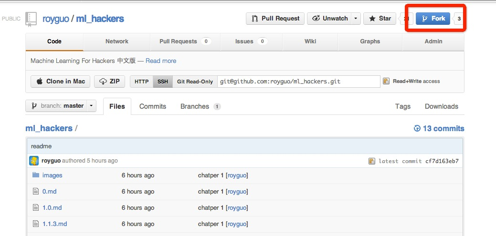
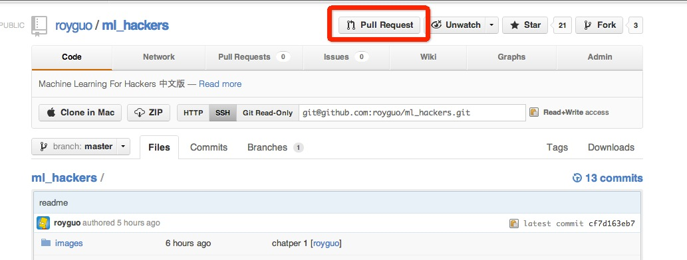

协作翻译规则说明
=============

## 1.准备工作 ##
>>>*工欲善其事，必先利其器*
 
 - 安装Git并熟练使用Github
 - 文本编辑器（或其他可以辅助编辑Markdown文档的工具）

我使用的编辑器是Sublime Text2 + Markdown Preview Plugin + Git Plugin

## 2.领取任务 ##
任务的领取可以直接发邮件给我，注明希望翻译的章节，获得通过后我会记录在README.md的**任务领取**中

## 3.开始翻译 ##
协作其实很简单，其实就是按照Github的协作规范来就可以了，这里再描述一遍：

1.fork本翻译库到自己的Github名下

2.对fork过的分支进行修改（任一分支都行，也可以直接用master分支）

3.把修改后的内容更新到自己的Github

4.请求我把你的更新放到我这里(Pull Request):

5.我如果通过或者拒绝合并，系统都会发送通知，按照说明继续后面的步骤即可，非常简单

6.系统会自动记录提供贡献的人及其贡献百分比，我会定期更新到README上

## 4.翻译过程 ##
只需要注意以下几点就可以了，其他都可以随意
 - 所有章节按照层次来分md文件，如第一章为1.md，第一章第一节为1.1.md，如果第一节下面还有可以增加为1.1.1.md等，最多分为三级（即1.1.1.md）。
 - 所有图片放到iamges文件夹下，按照原书的图片或表格截图并编号，如table 1-2.png、figure 1-2.png等。
 - 文本格式可以参考已经翻译的部分Preface的Markdown格式。

